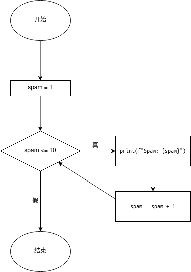

# 分支
在所有编程语言中都有分支这个概念，在C, C++, Java, Go等语言中，有if-else和switch这两种实现分支的方法，而Python简化了它的使用，只有if-else这种分支。

```python
a = 3
b = 3
if a == b:
    print("a == b:", a == b)
```

运行以上程序，输出：

```
a == b: True
```

来看点更复杂也更实用的：

```python
# BMI指数计算程序
height = float(input("Your Height(meter): "))
weight = float(input("Your Weight(kilogram): "))
bmi = weight / (height * height) # BMI指数为体重（千克）除以身高（米）的平方
print(f"Your BMI: {bmi}.", end='') # 不换行输出
if bmi <= 0:
    print(f"Invalid input.")
elif bmi <= 18.5: # 第七行
    print("Too thin.")
elif 18.5 < bmi <= 23.9:
    print("You are fit!")
elif 23.9 < bmi <= 27.9:
    print("A little bit overweight...")
else: # 第十四行
    print("Fat...")
```

运行一下这个程序：

```
Your Height(meter): 1.65
Your Weight(kilogram): 55
Your BMI: 20.202020202020204.You are fit!
```

代码说明

第5行：print(f"Your BMI: {bmi}.", end='')中的end=''表示不换行输出，即下一个print输出内容和Your BMI: {bmi}.在同一行。

第7行：`elif`

elif是else if的缩写。有时候你可能希望许多可能的子条件中，只有一个被执行。elif总是跟在if或另一个elif之后。它仅在这个if-elif-else所有位于它之前的语句都为假是才执行。

第14行：`else`

else语句只有前面的if和elif语句都为假时才执行。和if和elif不同，else语句不包含特定条件。

# 循环

## while语句

while循环通常用来创建“除非某一特定条件满足，否则一直运行循环内的语句”的循环：

```python
spam = 1
while spam <= 10:
    print(f"Spam: {spam}")
    spam = spam + 1 # spam变量的值自增1
```

运行结果：

```
Spam: 1
Spam: 2
Spam: 3
Spam: 4
Spam: 5
Spam: 6
Spam: 7
Spam: 8
Spam: 9
Spam: 10
```

程序逻辑：



一图胜千言，想必无需赘述了。

## for 循环
for循环相较于while循环，更适用于需要特定循环次数的循环，如上个例子可以这样用for循环重写：

```python
for spam in range(1, 11):
    print(f"Spam: {spam}")
```

for循环常与range一起使用，range返回一个含头不含尾并可以指定步长的列表：

```
>>> list(range(1, 11)) # 指定开头项和结尾项
[1, 2, 3, 4, 5, 6, 7, 8, 9, 10]
>>> list(range(1, 11, 2)) # 指定开头项、结尾项和步长
[1, 3, 5, 7, 9]
>>> list(range(11)) # 也可以指定结尾项
[0, 1, 2, 3, 4, 5, 6, 7, 8, 9, 10]
```

而for...in...让spam遍历range的返回值，并把这个返回值赋给spam。


## break和continue

### break

break关键字用于跳出循环，举个例子：

```python
spam = 1
while True:
    print(f"Spam: {spam}")
    spam = spam + 1 # spam变量的值自增1
    if spam == 10:
        break
print("Here")
```

运行结果：

```
Spam: 1
Spam: 2
Spam: 3
Spam: 4
Spam: 5
Spam: 6
Spam: 7
Spam: 8
Spam: 9
Spam: 10
Here
```

根据运行结果，我们不难看出当spam等于10输出完毕的时候，程序跳出了循环。

### continue
continue与break不同，continue用于停止当前一次循环并进入下一次循环：

```python
spam = 1
while spam <= 10:
    if spam == 5:
        continue
    print(f"Spam: {spam}")
    spam = spam + 1 # spam变量的值自增1
print("Here")
```

运行输出：
```
Spam: 1
Spam: 2
Spam: 3
Spam: 4
Spam: 6
Spam: 7
Spam: 8
Spam: 9
Spam: 10
Here
```

如输出，并没有输出Spam: 5的情况，因为它已经在输出之前进入了下一次循环

> 注意1:  break和continue也可用于for循环
> 注意2: 如果你不小心运行了一个无限循环，请激活命令窗口（在VS Code中就是单击VS Code的终端）并按下Ctrl+C可以强制停止运行

# 小练习
经过几章的学习，我们已经学习了编程中最重要的几个逻辑：顺序、分支和循环，我们来写一个经典的命令行小游戏——猜数字：
给出样例伪代码（伪代码部分仅为参考，无法运行，请用正确Python代码填充<伪代码>内的内容）：

```
# 这两行是可以成功运行的代码，用于获取1-100内的随机数
import random
secret = random.randint(1, 100)

# 以下为伪代码
guess = <获取用户输入>
while guess <不等于> secret:
    <如果> guess <大于> secret:
        <输出> "Too big!"
    <否则，如果> guess <小于> secret:
        <输出> "Too small!"
    guess = <获取用户输入>

<输出> "You get the correct number <秘密数字>!"
```

运行输出：

```
Guess a number from 1 to 100: 50
Too small!
Guess a number from 1 to 100: 75
Too small!
Guess a number from 1 to 100: 87
Too small!
Guess a number from 1 to 100: 93
Too large!
Guess a number from 1 to 100: 90
Too large!
Guess a number from 1 to 100: 88
You get the correct number 88!
```
